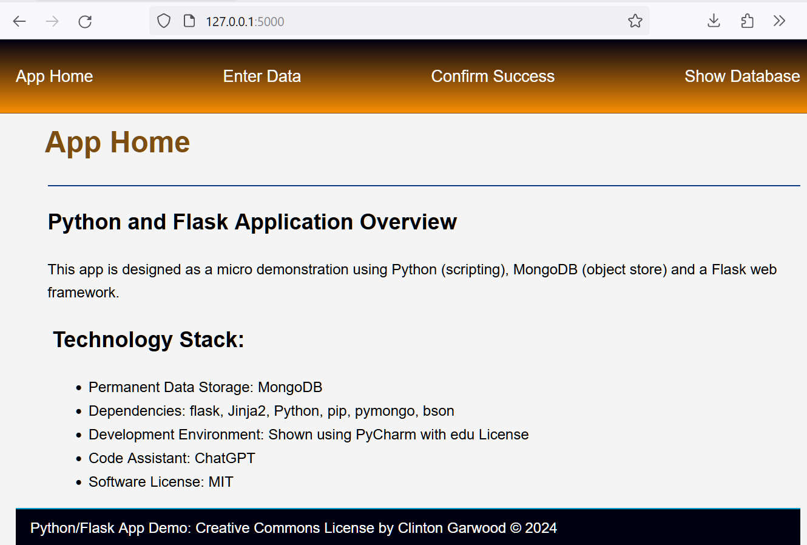
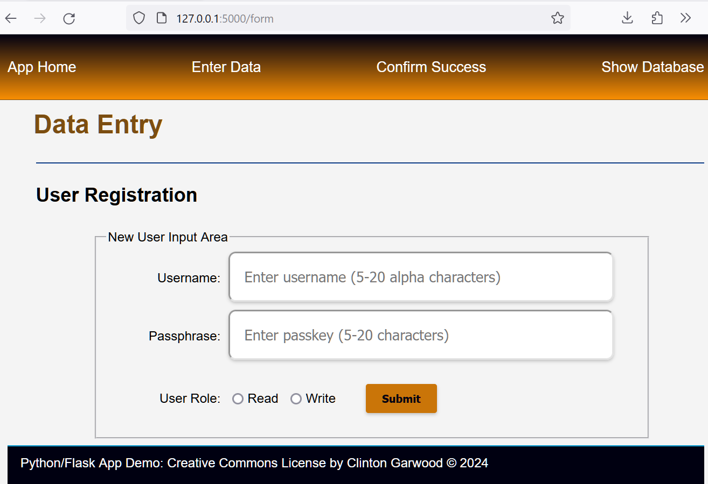
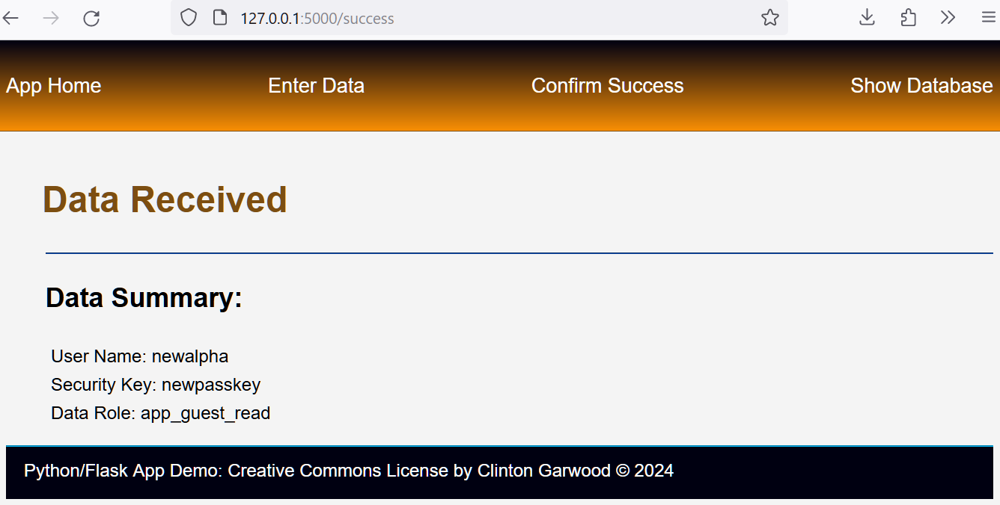
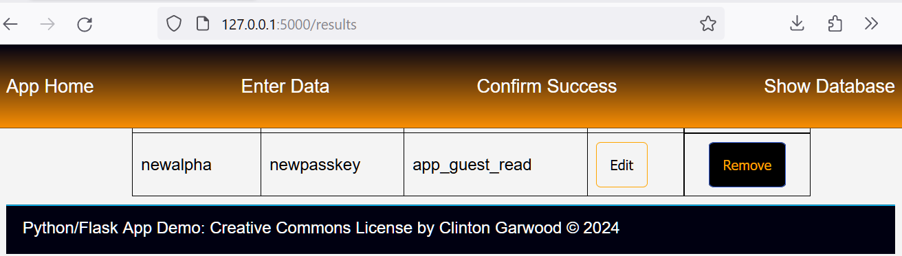

# Welcome to a Small Python/Flask/MongoDB Web App 

## App Overview:
Simple Demo App to show round-trip of data from a 
web form (entry) to a database (mongodb), and then 
presented back (as a table) in the web app. 

### App Home

### App Web Form

### New User

### App Data

### Site Requirements:
IDE (PyCharm), Python, pip
from flask import Flask, render_template, request, redirect, url_for
from pymongo import MongoClient
from bson import ObjectId

#### Site Directory
app.py
css/
    site_styles.css
docs/
    Readme.md
img/
    sf.ico
js/
    set_date.js
    data_buttons.js
templates/
    footer.html
    index.html
    nav.html
    results.html
    success.html
    web_form.html

#### this_file: Readme.md
#### License: MIT 
#### Online Version: https://github.com/theCodingProfessor/Round_Trip_Data_Python_Flask_MongoDB
